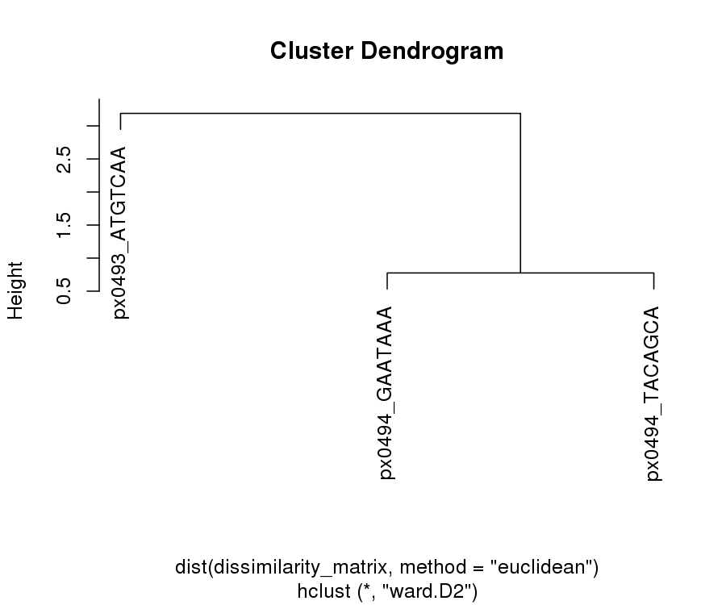
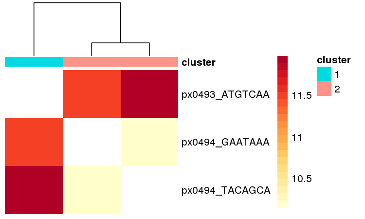
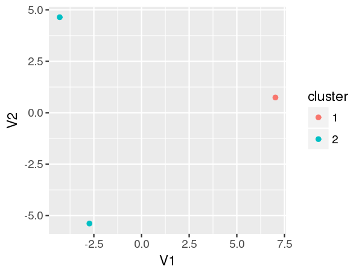

This package is based off the original PDclust publication: https://www.cell.com/stem-cell-reports/fulltext/S2213-6711(18)30308-4

The workflow for doing PDclust is as follows:

Step 0: Install
---------------

Easily install this package with `devtools`:

    devtools::install_github("hui-tony-zk/PDclust") 

Warning: this package requires the `tidyverse` suite of packages to work. I recommend you `install.packages(tidyverse)` first. If you're unfamiliar with the `tidyverse` suite, I highly recommend you learn more about it.

Step 1: Read in files
---------------------

The input to the `PDclust` workflow is a named list of data frames containing CpG calls for each single-cell.

The four columns should be named as follows: `chr`, `start`, `end`, `meth` (for percent methylation).

As an example, there is a sample dataset included with this package (`cpg_files`) that contains three single-cells.

``` r
cpg_files
#> $px0494_TACAGCA
#> # A tibble: 33,770 x 4
#>      chr    start      end  meth
#>    <chr>    <int>    <int> <dbl>
#>  1 chr22 16069420 16069421   100
#>  2 chr22 16069513 16069514   100
#>  3 chr22 16069531 16069532   100
#>  4 chr22 16127391 16127392   100
#>  5 chr22 16127421 16127422   100
#>  6 chr22 16127431 16127432     0
#>  7 chr22 16127637 16127638   100
#>  8 chr22 16144984 16144985   100
#>  9 chr22 16154880 16154881   100
#> 10 chr22 16154917 16154918   100
#> # ... with 33,760 more rows
#> 
#> $px0493_ATGTCAA
#> # A tibble: 28,962 x 4
#>      chr    start      end  meth
#>    <chr>    <int>    <int> <dbl>
#>  1 chr22 16056574 16056575   100
#>  2 chr22 16056839 16056840   100
#>  3 chr22 16056862 16056863     0
#>  4 chr22 16056917 16056918   100
#>  5 chr22 16059002 16059003     0
#>  6 chr22 16073465 16073466   100
#>  7 chr22 16124089 16124090   100
#>  8 chr22 16124117 16124118   100
#>  9 chr22 16124122 16124123   100
#> 10 chr22 16124133 16124134   100
#> # ... with 28,952 more rows
#> 
#> $px0494_GAATAAA
#> # A tibble: 49,122 x 4
#>      chr    start      end  meth
#>    <chr>    <int>    <int> <dbl>
#>  1 chr22 16069513 16069514   100
#>  2 chr22 16069531 16069532     0
#>  3 chr22 16122837 16122838   100
#>  4 chr22 16122844 16122845   100
#>  5 chr22 16122849 16122850   100
#>  6 chr22 16122857 16122858   100
#>  7 chr22 16122869 16122870     0
#>  8 chr22 16122875 16122876   100
#>  9 chr22 16122887 16122888   100
#> 10 chr22 16122890 16122891   100
#> # ... with 49,112 more rows
```

Step 2: calculate pairwise dissimilarity with `create_pairwise_master()`
------------------------------------------------------------------------

The second step is to do pairwise calculations. This results in a data.frame with the results.

``` r
cpg_files_pairwise <- create_pairwise_master(cpg_files)
cpg_files_pairwise
#> # A tibble: 3 x 4
#>                x              y num_cpgs pairwise_dissimilarity
#>            <chr>          <chr>    <int>                  <dbl>
#> 1 px0494_TACAGCA px0493_ATGTCAA     2423               11.96863
#> 2 px0494_TACAGCA px0494_GAATAAA     3665               10.15007
#> 3 px0493_ATGTCAA px0494_GAATAAA     3498               11.52087
```

You can also parallelize this function over many cores in case you have many samples. Keep in mind that there are `nC2` calculations to make, where `n` is the number of single-cells. Thus, for many samples, it might take a long time.

For reference, 100 single-cells takes about 30 minutes.

``` r
create_pairwise_master(cpg_files, cores_to_use = 2)
#> # A tibble: 3 x 4
#>                x              y num_cpgs pairwise_dissimilarity
#>            <chr>          <chr>    <int>                  <dbl>
#> 1 px0494_TACAGCA px0493_ATGTCAA     2423               11.96863
#> 2 px0494_TACAGCA px0494_GAATAAA     3665               10.15007
#> 3 px0493_ATGTCAA px0494_GAATAAA     3498               11.52087
```

You can include non-binary methylation calls in your distance calculation in cases where you aren't working with single-cells, or have reason to believe that a CpG site might not be binary (in cases such as copy number variants).

``` r
create_pairwise_master(cpg_files, digital = FALSE)
#> # A tibble: 3 x 4
#>                x              y num_cpgs pairwise_dissimilarity
#>            <chr>          <chr>    <int>                  <dbl>
#> 1 px0494_TACAGCA px0493_ATGTCAA     2432               12.08882
#> 2 px0494_TACAGCA px0494_GAATAAA     3699               10.50584
#> 3 px0493_ATGTCAA px0494_GAATAAA     3538               11.93173
```

If you want to use your own metric instead of dissimilarity, you can set `calcdiff = FALSE` to generate the list of pairwise joins

``` r
create_pairwise_master(cpg_files, calcdiff = FALSE)
#> $px0494_TACAGCA_px0493_ATGTCAA
#> # A tibble: 2,423 x 4
#>      chr      pos px0494_TACAGCA px0493_ATGTCAA
#>    <chr>    <int>          <dbl>          <dbl>
#>  1 chr22 16211300              0            100
#>  2 chr22 16211399            100              0
#>  3 chr22 16869589            100            100
#>  4 chr22 16884435            100            100
#>  5 chr22 16884438            100            100
#>  6 chr22 16884443            100            100
#>  7 chr22 16884449            100            100
#>  8 chr22 16884464            100            100
#>  9 chr22 17041719              0            100
#> 10 chr22 17041745            100              0
#> # ... with 2,413 more rows
#> 
#> $px0494_TACAGCA_px0494_GAATAAA
#> # A tibble: 3,665 x 4
#>      chr      pos px0494_TACAGCA px0494_GAATAAA
#>    <chr>    <int>          <dbl>          <dbl>
#>  1 chr22 16069513            100            100
#>  2 chr22 16069531            100              0
#>  3 chr22 16228528            100              0
#>  4 chr22 16228531            100            100
#>  5 chr22 16228545            100              0
#>  6 chr22 16228563            100              0
#>  7 chr22 16228599            100              0
#>  8 chr22 16228660            100            100
#>  9 chr22 16364928            100            100
#> 10 chr22 16869495            100            100
#> # ... with 3,655 more rows
#> 
#> $px0493_ATGTCAA_px0494_GAATAAA
#> # A tibble: 3,498 x 4
#>      chr      pos px0493_ATGTCAA px0494_GAATAAA
#>    <chr>    <int>          <dbl>          <dbl>
#>  1 chr22 16192355            100            100
#>  2 chr22 16192363            100            100
#>  3 chr22 16192401            100            100
#>  4 chr22 16192451            100            100
#>  5 chr22 16288217            100            100
#>  6 chr22 16288248            100              0
#>  7 chr22 16288274              0            100
#>  8 chr22 16288291            100            100
#>  9 chr22 16288310            100            100
#> 10 chr22 16288337            100            100
#> # ... with 3,488 more rows
```

Step 3: Convert the data.frame to a symmetrical matrix using `convert_to_dissimilarity_matrix()`
------------------------------------------------------------------------------------------------

This turns the data.frame into a clustering-ready matrix

``` r
cpg_files_pairwise_matrix <- convert_to_dissimilarity_matrix(cpg_files_pairwise)
cpg_files_pairwise_matrix
#>                px0493_ATGTCAA px0494_GAATAAA px0494_TACAGCA
#> px0493_ATGTCAA             NA       11.52087       11.96863
#> px0494_GAATAAA       11.52087             NA       10.15007
#> px0494_TACAGCA       11.96863       10.15007             NA
```

Step 4: Clustering
------------------

### A) Generating clusters with PDclust

This step clusters the single-cells together with `cluster_dissimilarity()`

``` r
cluster_results <- cluster_dissimilarity(cpg_files_pairwise_matrix, num_clusters = 2)
```

You can plot the resulting cluster results:

``` r
plot(cluster_results$hclust_obj)
```



... and view the clustering results

``` r
cluster_results$cluster_assignments
#>                cluster
#> px0493_ATGTCAA       1
#> px0494_GAATAAA       2
#> px0494_TACAGCA       2
```

... or use a fancy heatmap

``` r
heatmap_pallete <- colorRampPalette(RColorBrewer::brewer.pal(8, name = "YlOrRd"))(21)

pheatmap(cpg_files_pairwise_matrix,
         cluster_rows = cluster_results$hclust_obj,
         cluster_cols = cluster_results$hclust_obj,
         treeheight_row = 0,
         border_color = NA,
         color = heatmap_pallete,
         show_colnames = F,
         annotation_col = cluster_results$cluster_assignments)
```



B) Visualize the cluster separation:
------------------------------------

This function projects the dissimilarities into 2D space (using `cmdscale`), and appends clustering results (if included) for easy coloring in `ggplot` later

``` r
viz_df <- visualize_clusters(cpg_files_pairwise_matrix, cluster_labels = cluster_results$cluster_assignments)
viz_df
#> # A tibble: 3 x 4
#>        Row.names        V1        V2 cluster
#>       <S3: AsIs>     <dbl>     <dbl>  <fctr>
#> 1 px0493_ATGTCAA  7.023612  0.741866       1
#> 2 px0494_GAATAAA -2.732533 -5.385781       2
#> 3 px0494_TACAGCA -4.291078  4.643915       2
```

``` r
ggplot(viz_df, aes(V1, V2, color = cluster)) +
  geom_point()
```

 

Optional Step 5: *in silico* merge single-cells by cluster
----------------------------------------------------------

This function requires the `bsseq` package to be installed: <https://github.com/kasperdanielhansen/bsseq>

*(in this example, we merge the two group2 cells)*

``` r
group2_merge <- merge_cpgs(cpg_files,
                           cluster_assignments = cluster_results$cluster_assignments,
                           desired_cluster = 2)
#> Loading required package: bsseq
#> Loading required package: BiocGenerics
#> Loading required package: parallel
#> 
#> Attaching package: 'BiocGenerics'
#> The following objects are masked from 'package:parallel':
#> 
#>     clusterApply, clusterApplyLB, clusterCall, clusterEvalQ,
#>     clusterExport, clusterMap, parApply, parCapply, parLapply,
#>     parLapplyLB, parRapply, parSapply, parSapplyLB
#> The following objects are masked from 'package:dplyr':
#> 
#>     combine, intersect, setdiff, union
#> The following objects are masked from 'package:stats':
#> 
#>     IQR, mad, xtabs
#> The following objects are masked from 'package:base':
#> 
#>     anyDuplicated, append, as.data.frame, cbind, colnames,
#>     do.call, duplicated, eval, evalq, Filter, Find, get, grep,
#>     grepl, intersect, is.unsorted, lapply, lengths, Map, mapply,
#>     match, mget, order, paste, pmax, pmax.int, pmin, pmin.int,
#>     Position, rank, rbind, Reduce, rownames, sapply, setdiff,
#>     sort, table, tapply, union, unique, unsplit, which, which.max,
#>     which.min
#> Loading required package: GenomicRanges
#> Loading required package: stats4
#> Loading required package: S4Vectors
#> 
#> Attaching package: 'S4Vectors'
#> The following objects are masked from 'package:dplyr':
#> 
#>     first, rename
#> The following objects are masked from 'package:base':
#> 
#>     colMeans, colSums, expand.grid, rowMeans, rowSums
#> Loading required package: IRanges
#> 
#> Attaching package: 'IRanges'
#> The following objects are masked from 'package:dplyr':
#> 
#>     collapse, desc, regroup, slice
#> Loading required package: GenomeInfoDb
#> Loading required package: SummarizedExperiment
#> Loading required package: Biobase
#> Welcome to Bioconductor
#> 
#>     Vignettes contain introductory material; view with
#>     'browseVignettes()'. To cite Bioconductor, see
#>     'citation("Biobase")', and for packages 'citation("pkgname")'.
#> Loading required package: limma
#> 
#> Attaching package: 'limma'
#> The following object is masked from 'package:BiocGenerics':
#> 
#>     plotMA
group2_merge
#> An object of type 'BSseq' with
#>   79193 methylation loci
#>   1 samples
#> has not been smoothed
```
